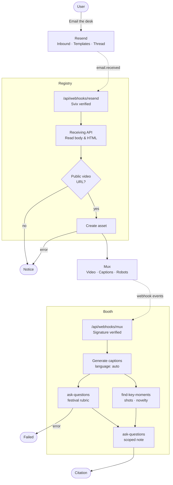

# Postage

Postage is an email-native footage festival. You send one public video URL to the booth, the tape is ingested and screened, and a citation comes back in the same thread. It uses Mux Robots for auto-captioning and parallel evaluations, and Resend Inbound for receiving submissions and delivering threaded replies.

## Architecture

The diagram below illustrates the path from a submitted link to a threaded reply.



## Running Locally

Follow these steps to set up and run Postage on your local machine.

### Prerequisites

This app requires **[Node.js](https://nodejs.org) 24.11.1+** and **[pnpm](https://pnpm.io)**. You also need accounts on [Mux](https://www.mux.com), [Resend](https://resend.com), and [ngrok](https://ngrok.com).

### 1. Cloning the Repository

```bash
git clone https://github.com/nabarvn/postage.git
cd postage
```

### 2. Installing Dependencies

```bash
pnpm install
```

### 3. Environment Variables

Create a local environment file by copying the example:

```bash
cp .env.example .env
```

> [!IMPORTANT]
> Ensure you populate the variables with your respective API keys and configuration values before proceeding.

### 4. Ngrok Setup

Mux and Resend both need a stable HTTPS endpoint to deliver webhooks.

1. [Install ngrok](https://ngrok.com/docs) and sign in.
2. Grab your free dev domain from the [ngrok dashboard](https://dashboard.ngrok.com) (e.g. `your-subdomain.ngrok-free.app`).
3. Start the stable public tunnel in a separate terminal:

   ```bash
   ngrok http 3000 --url https://your-subdomain.ngrok-free.app
   ```

This creates your two webhook routes:

- `https://your-subdomain.ngrok-free.app/api/webhooks/mux`
- `https://your-subdomain.ngrok-free.app/api/webhooks/resend`

### 5. Services Configuration

**Mux**

- Confirm **Robots** is enabled in your dashboard, then create a new access token with **Video** and **Robots** permissions. Copy the Token ID and Secret to `MUX_TOKEN_ID` and `MUX_TOKEN_SECRET` in `.env`.
- Add a webhook pointing to your ngrok Mux URL. Copy the endpoint signing secret to `MUX_WEBHOOK_SECRET`.

**Resend**

- Set `NEXT_PUBLIC_RESEND_RECEIVING_ADDRESS` in `.env` to your `*.resend.app` receiving address.
- Create and publish your templates (Citation and Notice). Add the required string variables to Citation (`TITLE`, `CATEGORY`, `SYNOPSIS`, `AWARD`, `NOTE`, `VERDICT`) and Notice (`NOTICE`). Set their respective `RESEND_*_TEMPLATE_ID`s in `.env`.
- Add a custom domain and verify your DNS records. Set `RESEND_FROM` in `.env`. Optionally, enable **Receiving** (requires an MX record) and set `NEXT_PUBLIC_CUSTOM_RECEIVING_ADDRESS` to accept submissions on your own branded email address.
- Create an API key and copy it to `RESEND_API_KEY` in `.env`.
- Add a webhook listening for the `email.received` event at your ngrok Resend URL. Copy the signing secret to `RESEND_WEBHOOK_SECRET`.

### 6. Running the Application

Start the Next.js dev server once your ngrok tunnel is active in a separate terminal:

```bash
pnpm dev
```

> [!NOTE]
> Open `http://localhost:3000` in your browser to access the local app.
> Send an email containing a public video URL to your configured receiving address to test the screening pipeline.

## Tech Stack

- **Language**: [TypeScript](https://www.typescriptlang.org)
- **Framework**: [Next.js](https://nextjs.org)
- **Styling**: [Tailwind CSS](https://tailwindcss.com)
- **Video Processing**: [Mux](https://mux.com)
- **Email Delivery**: [Resend](https://resend.com)

## Engineering Notes

- Mux generates captions before doing anything else. Once ready, the general screening and key moments tasks run at the same time. The note task runs last, focused specifically on the best moment found in the video.
- The Resend webhook only provides metadata, so the app fetches the actual email body right after. Replies stay in the correct thread using an `In-Reply-To` header and use a unique key to prevent duplicate sends.
- Because key moments use milliseconds and the note scope uses seconds, the end time is pulled back by one millisecond. This ensures the reading window never exceeds the total video duration.
- Only public video links work. Google Drive and Dropbox links are rewritten into direct download URLs so Mux can process them. Internal network links and URLs buried in old email replies are ignored.
- If key moments detection fails, the note evaluation runs unscoped; if the note task fails, the citation is generated directly from screening outputs; and processed assets in Mux are pruned automatically to keep only the five most recent submissions.

<hr />

<div align="center">Don't forget to leave a STAR 🌟</div>
